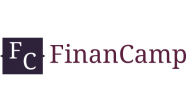

### Hello, world! We are a The FinanCamp. 👋
FinanCamp is a week-long program for international students that takes place entirely in English. We provide materials (and knowledge) on economics, financial mathematics, and politics. We seek engaged young people, entrepreneurs, and innovators, with autonomy and a sense of leadership. The project is free, but it is necessary to go through the selective project. Come change the world with us!

  

## Connect with me:

 
  
  

